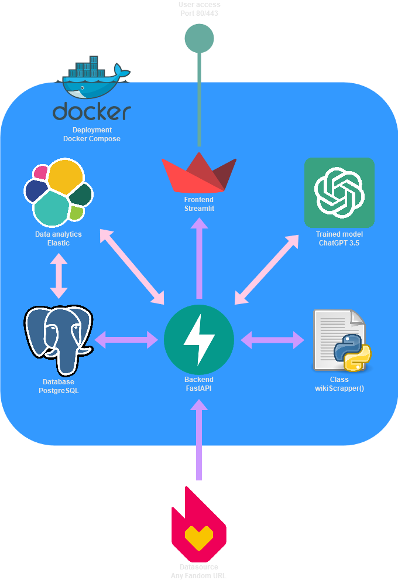

# FANDOM DATA ANALYSIS

## General information


Event: TELIT HACKATHON 2023  

Team: Mrkva  

Members:  
- [x] Tomáš Kormaník  
- [x] Marek Horváth  
- [x] Daniel Fedič  
- [x] Michaela Vaľovská  
- [x] Diana Oršolyová  

## Project structure diagram



## Prepare environment

All required packages are listed in `requirements.txt` file. To install them, run:

```bash
pip install -r requirements.txt
```

## Deploy PostgreSQL, FastAPI and StreamLit

We are using docker to deploy our database and api. To deploy them, simply run:

```bash
docker-compose up
```

- PostgreSQL is available at port `5432`
- FastAPI is available at port `80`
- StreamLit at port `8501`

## API Documentation

### Root

- **Method:** `GET`
- **Path:** `/`
- **Description:** Get a basic message.

#### Request
- None

#### Response
- **200 OK**
  - Body: `{"message": "Please make requests using provided API documentation !"}`

---

### Add Fandom Wiki

- **Method:** `POST`
- **Path:** `/fandom_wikis/add`
- **Description:** Add a Fandom Wiki to the database.

#### Request
- **Body:**
  ```json
  {
    "url": "string"
  }
  ```

#### Response
- **200 OK**
  - Body: `{"message": "Table {table_name} created and rows inserted successfully"}`

- **500 Internal Server Error**
  - Body: `{"detail": "Error inserting rows: {error_message}"}`

---

### Get Fandom Wiki

- **Method:** `GET`
- **Path:** `/fandom_wikis/{table_name}`
- **Description:** Get information about a specific Fandom Wiki.

#### Request
- None

#### Response
- **200 OK**
  - Body: 
    ```json
    {
      "id": "integer",
      "human_readable_name": "string",
      "database_table_name": "string",
      "description": "string",
      "is_template": "boolean"
    }
    ```

- **404 Not Found**
  - Body: `{"detail": "Table not found"}`

---

### Get Fandom Wikis

- **Method:** `GET`
- **Path:** `/fandom_wikis`
- **Description:** Get a list of all Fandom Wikis.

#### Request
- None

#### Response
- **200 OK**
  - Body: `[{"id": "integer", "human_readable_name": "string", "database_table_name": "string", "description": "string", "is_template": "boolean"}]`

---

### Get Fandom Wiki Contents

- **Method:** `GET`
- **Path:** `/fandom_wikis/{table_name}/contents`
- **Description:** Get all contents of a specific Fandom Wiki.

#### Request
- None

#### Response
- **200 OK**
  - Body: `[{"id": "integer", "html_tag": "string", "contents": "string", "link": "string"}]`

- **404 Not Found**
  - Body: `{"detail": "Table not found"}`

---

### Get Fandom Wiki Contents (Filtered)

- **Method:** `GET`
- **Path:** `/fandom_wikis/{table_name}/contents/{searched_keyword}`
- **Description:** Get contents of a specific Fandom Wiki filtered by a keyword.

#### Request
- None

#### Response
- **200 OK**
  - Body: `[{"id": "integer", "html_tag": "string", "contents": "string", "link": "string"}]`

- **404 Not Found**
  - Body: `{"detail": "Table not found"}`

---

### Get Fandom Wiki Contents (Filtered by Keyword and Tag)

- **Method:** `GET`
- **Path:** `/fandom_wikis/{table_name}/contents/{searched_keyword}/{tag}`
- **Description:** Get contents of a specific Fandom Wiki filtered by a keyword and tag.

#### Request
- None

#### Response
- **200 OK**
  - Body: `[{"id": "integer", "html_tag": "string", "contents": "string", "link": "string"}]`

- **404 Not Found**
  - Body: `{"detail": "Table not found"}`
